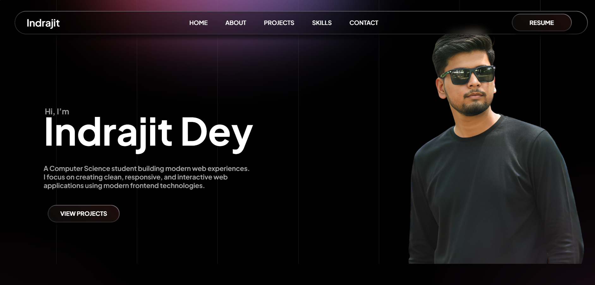

# 🌐 Indrajit Dey — Portfolio Website

<p align="center">
  <a href="https://indrajit-dey-portfolio.vercel.app/">
    
  </a>
  
  
  
</p>

<p align="center">
<b>Modern • Responsive • Interactive Portfolio</b>
</p>

---

## ✨ About Me

Hi, I'm **Indrajit Dey**, a Computer Science student passionate about building modern web experiences.
I focus on creating **clean, responsive, and interactive web applications** using modern frontend technologies.

---

## 🚀 Live Website

🔗 **Visit here:**
👉 https://indrajit-dey-portfolio.vercel.app/

---

## 📸 Screenshots

### 🏠 Home Page


```md

```


---

## 🚀 Features

* 🏠 Modern hero section
* 👤 About me section
* 💼 Projects showcase
* 🛠 Skills display
* 📬 Contact section
* 📄 Resume download button
* 🌙 Dark gradient UI
* 📱 Fully responsive

---

## 🛠 Tech Stack

<p>

</p>

* HTML5
* CSS3
* JavaScript
* Vercel Deployment

---

## ⚙️ Run Locally

```bash
git clone https://github.com/Indrajitdey45/Indrajit-Dey---Portfolio.git
cd Indrajit-Dey---Portfolio
npm install
npm start
```

---

## 📬 Contact

* GitHub: https://github.com/Indrajitdey45
* LinkedIn: https://www.linkedin.com/in/indrajit-dey-56819a294/
* Instagram: https://www.instagram.com/indrajit_dey_45/

---

## ⭐ Support

If you like this project, give it a **star ⭐ on GitHub**.

---

<p align="center">
Made with ❤️ by <b>Indrajit Dey</b>
</p>
